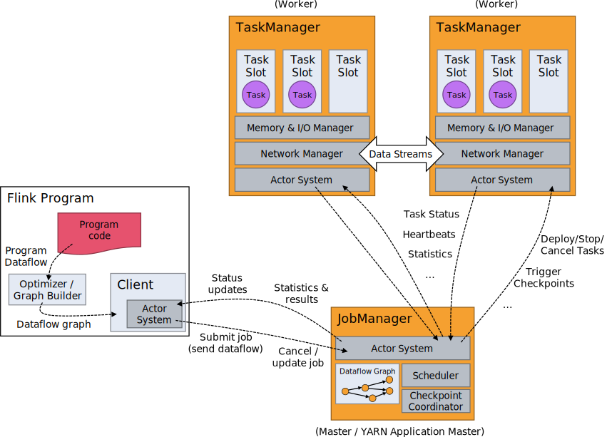

# Flink Architecture

Flink is distributed in nature and it requires effective resource allocations in order to perform stream processing.

Flink uses two main types of processes running in pallets: job manager and task manager.

Flink uses Client to prepare and send a dataflow to the JobManager. Once the dataflow is submitted to the JobManager,
it can detach or stay connected to receive progress reports. The client usually runs Java program that triggers the 
execution and is executed using `./bin/flink run` command. The JobManager and TaskManagers can be started in various 
ways: as a distributed cluster in YARN or as a single process as a standalone cluster.

## Job Manager

The JobManager is the main process that coordinates the execution of the dataflow. It is responsible for 
coordinating the execution of the Flink application. It also decides when to start and stop the TaskManagers, 
coordinate checkpoints, recovery from failures, etc. A high-availablility cluster can have multiple JobMasters, where one of them is acting as a leader and others are
standby. There are three components of the JobManager.
- JobMaster
- ResourceManager
- Dispatcher

### JobMaster

It is responsible for managing the execution of a single JobGraph. Each job on the cluster has a single JobMaster. 

### ResourceManager

This component is responsible for resource allocation/deallocation in a Flink cluster. Flink supports multiple 
resource managers for different environments such as YARN, Kubernetes, and Mesos, standalone deployments. It manages 
resource scheduling using task slots in a Flink cluster.

### Dispatcher

The dispatcher is a REST interface that allows users to submit jobs to the cluster. It also runs the Flink webUI 
which is used to display the status of job execution.

## Task Manager

Task Managers are responsible for execution of tasks of a dataflow and exchange the data streams. The smallest unit 
of resource scheduling in a Task manager is a task slot. The number of task slots in a TaskManager indicates the 
number of concurrent tasks that can be executed in the TaskManager. TaskManager or worker is a JVM process that can 
execute tasks. A TaskManager can accept multiple tasks upto available task slots. A TaskManager will divide its 
managed memory to each slot and assign to each task.

## Application

Flink application can be submitted as a jar file or a Java class. It can be submitted in a session cluster, job 
cluster or application cluster. 

### Flink Application Cluster
It is a dedicated cluster that only executes jobs from one application. In this case, the `main()` method runs on 
the cluster rather than the client. You package the application along with dependencies into a JAR file and submit 
the job to the cluster. The ResourceManager and Dispatcher are scoped to a single Flink application rather than 
Flink session cluster.

### Flink Session Cluster
In this case, the client connects to pre-existing, long running cluster. The cluster lifetime is not bound to the 
application or job. Task slots are allocated by ResourceManager on job submission and deallocated when the job is 
finished.

### Flink Job Cluster (Deprecated)
In this case, cluster managers like YARN will spin up a cluster for each submitted job and the cluster is available 
to that specific job only. When the job finishes, the Flink job cluster is terminated. This is deprecated in newer 
versions of Flink.

